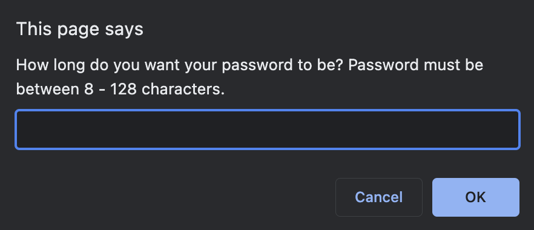
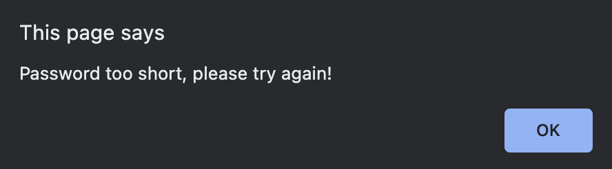
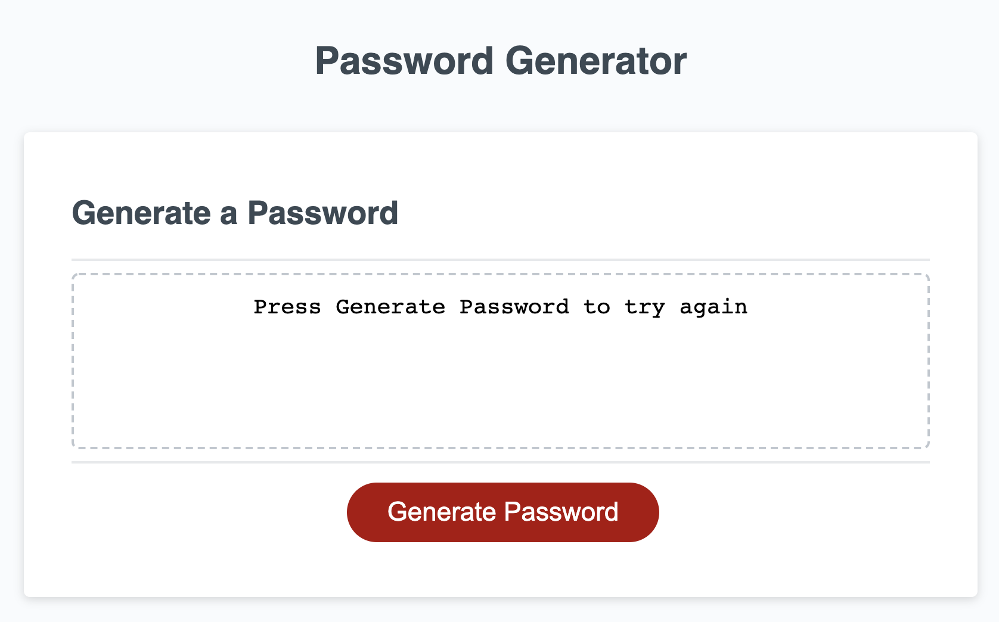
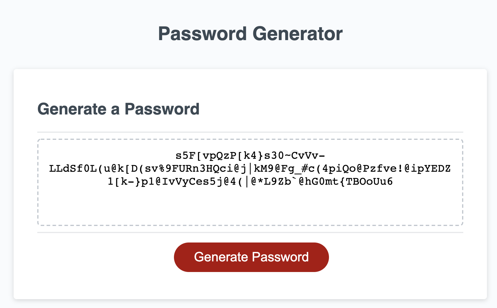

# READ ME - Brenton Weaver Password Maker

Link: https://brento20.github.io/password.maker/

**GIVEN** I need a new, secure password
**WHEN** I click the button to generate a password
**THEN** I am presented with a series of prompts for password criteria

**WHEN** prompted for password criteria
**THEN** I select which criteria to include in the password

**WHEN** prompted for the length of the password
**THEN** I choose a length of at least 8 characters and no more than 128 characters

**WHEN** asked for character types to include in the password
**THEN** I confirm whether or not to include lowercase, uppercase, numeric, and/or special characters

**WHEN** I answer each prompt
**THEN** my input should be validated and at least one character type should be selected

**WHEN** all prompts are answered
**THEN** a password is generated that matches the selected criteria

**WHEN** the password is generated
**THEN** the password is either displayed in an alert or written to the page

| Task | Status |
|--|--|
| Button activates JavaScript | Complete |
| User can select password length | Complete |
| User can select Upper/Lower or Special Characters   | Complete |
| Password includes the user selected criteria | Complete |
| The password is displayed on the page or in a alert prompt | Complete |

**The following build was attempted by Brenton Weaver - Brento20 - brenton.weaver@gmail.com**

 
 1. Logic Plan.
 2. Future Improvements.
 3. Screenshots of deployed application.

## Logic Plan.

When a user clicks the Generate Password Button:

1. A prompt window opens asking for a number.
    -use prompt to ask for user input
    -store in a var passwordLength
2. This input is checked to make sure is a number equal to or greater than 8, equal to or lesser than 128 and is equal to a number.
    -use if and else if statements for this step
3. If incorrect input, a return fills the html text box with an error message and a alert tells the user how to correct the error.
4. The user is prompted to select if they want Upper/Lower/Special or numbers included int the password.
5. Confirms trigger a boolean to push a set of characters into an empty array called characterPool.
6. The passwordLength and characterPool are fed into a for loop that uses math.random to pull a random string matching the desired length and its returned to the HTML text box.

## Future improvements.

1. Error messages; I still need to work out why I cant get the error message to work on alpha characters. -- worked out!!!
2. I also should work out how to get the upper/lower/special/number arrays that i defined with the var to actually push into the characterPool. -- worked out!!!
3. When the user selects no character sets it should have an error message. --- not done
4. use the .splice method to make the arrays more readable.

## Screenshots of deployed application.

Example of the first prompt message:

Example of an error alert:

Example of text returned to html after an error:

Example of password with all character sets, and a length of 60.
